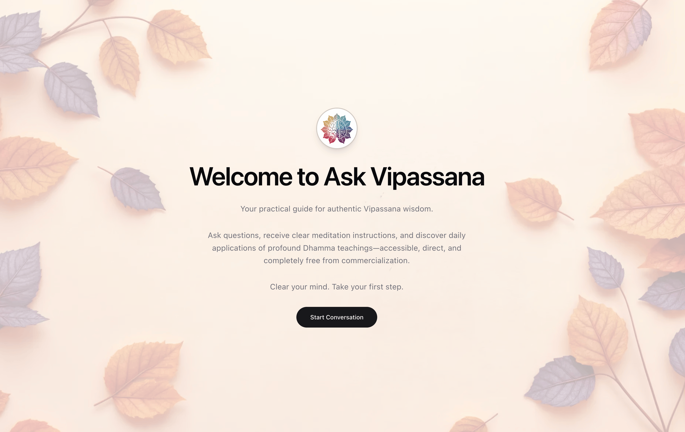

<div align="center">
  <a href="https://github.com/Saik0s/ask-vipassana">
    
  </a>

  <h3 align="center">Ask Vipassana</h3>

  <p align="center">
Welcome to Ask Vipassana, a mindful chatbot providing authentic Buddhist wisdom through a conversational interface. Access clear guidance on meditation techniques, Dhamma teachings, and practical spiritual advice—completely free from commercialization.
  </p>
</div>
<hr />

<div align="center">

</div>
<hr />
<p align="center">
    
    <a href="https://x.com/sa1k0s">
        
    </a>
    <a href="https://github.com/saik0s">
        
    </a>
    
</p>

# Ask Vipassana

A mindful chatbot application providing authentic Vipassana Buddhist wisdom through a conversational interface. This tool offers clear guidance on meditation techniques, Dhamma teachings, and practical spiritual advice while maintaining the purity and non-commercial nature of Vipassana meditation.

## Features

- 🧘 Minimalist chat interface embodying Vipassana simplicity
- 🌅 Subtle, mindful animations enhancing the experience
- ⏲️ Optional meditation timer integrated within chat
- 📚 Source reference system citing original texts
- 💭 Contextual memory for continuous spiritual guidance
- 🔒 Privacy-focused with local storage only

## Tech Stack

- **Framework:** [Next.js 14](https://nextjs.org/) with TypeScript
- **Styling:** [Tailwind CSS](https://tailwindcss.com/)
- **UI Components:** [shadcn/ui](https://ui.shadcn.com/)
- **Animations:** [Framer Motion](https://www.framer.com/motion/)
- **Backend:** N8N server with custom API endpoint
- **Storage:** Local storage for chat history

## Getting Started

1. **Clone the repository**
   ```bash
   git clone <repository-url>
   cd ask-vipassana
   ```

2. **Install dependencies**
   ```bash
   npm install
   # or
   yarn install
   # or
   pnpm install
   ```

3. **Environment Variables Setup**
   - Copy the `.env.example` file to `.env`:
     ```bash
     cp .env.example .env
     ```
   - Add your Groq API key

4. **Start the development server**
   ```bash
   npm run dev
   # or
   yarn dev
   # or
   pnpm dev
   ```

5. **Open [http://localhost:3000](http://localhost:3000) with your browser**

## Environment Variables

Create a `.env` file in the root directory with the following variables:

```env
GROQ_API_KEY=your-groq-api-key
```

## Project Structure

```
ask-vipassana/
├── app/                # Next.js app router pages
├── components/         # React components
│   ├── ui/            # shadcn/ui components
│   └── providers/     # Context providers
├── hooks/             # Custom React hooks
├── lib/               # Utility functions
├── public/            # Static assets
└── types/             # TypeScript type definitions
```

## Design Philosophy

The interface embodies core Vipassana principles:

- **Simplicity:** Clean, distraction-free design
- **Mindfulness:** Purposeful, subtle animations
- **Authenticity:** Direct connection to original teachings
- **Non-materialistic:** No commercialization or gamification
- **Privacy:** Minimal data storage, no tracking

## Ethical Considerations

- This is an AI-assisted tool, not a replacement for human teachers
- No tracking of personal meditation experiences
- No commercialization of Dhamma content
- Easy conversation history clearing
- Clear disclaimers about AI limitations
